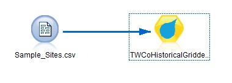

# Extension for TWCo Historical Gridded
This implementation allows you to connect to APIs provided by The Weather Company from IBM SPSS Modeler. These APIs will require a key so that you can retrieve the actual weather data. Please contact your IBM sales representative so that we can assist you to obtain the key. 

---
# Overview

Please refer to [TWC Cleaned Observations API Documentation](./TWC Cleaned Observations API Documentation.pdf)

---
# Overview for Historical Gridded
Import high resolution, gridded historical weather observations for a set of locations and dates.

---
# Reference
[The Weather Company](http://www.theweathercompany.com/)  
[Historical Weather](http://goo.gl/DplOKj)

---

#Requirements
- IBM SPSS Modeler v18
- R Essentials for SPSS Modeler plugin 

More information here: [IBM Predictive Extensions][2]

---

#License
[Apache 2.0][1]

#Contributors
- Yu Wenpei [(mail)](yuwenp@cn.ibm.com)

[1]: http://www.apache.org/licenses/LICENSE-2.0.html
[2]: https://developer.ibm.com/predictiveanalytics/downloads/#tab2
